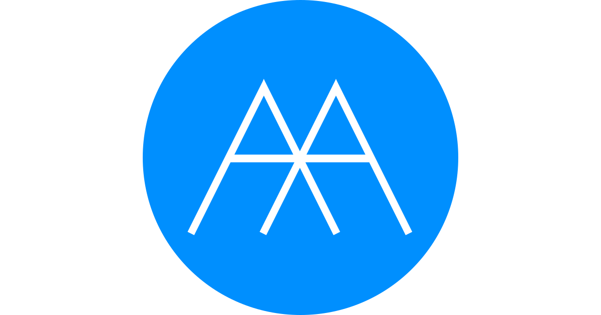

# Symbol

## TinyKitten シンボルの由来

青い背景にアーチが美しいこのシンボルは、ギリシャ文字の Α(アルファ)を 2 つ重ねたフリーランスエンジニア TinyKitten シンボルです。

それぞれのアルファには「小さなモノ」という意味が込められていて、アルファが重なりより小さな欠片から大きなモノを作りたいという意志が込められています。

## The story of TinyKitten Symbol

This symbol, with its beautiful arches on a blue background, is the freelance engineer TinyKitten symbol, consisting of two overlapping Greek letters Α (alpha).

Each alpha means "small thing," and the overlapping alphas express the will to create a larger thing from smaller fragments.
